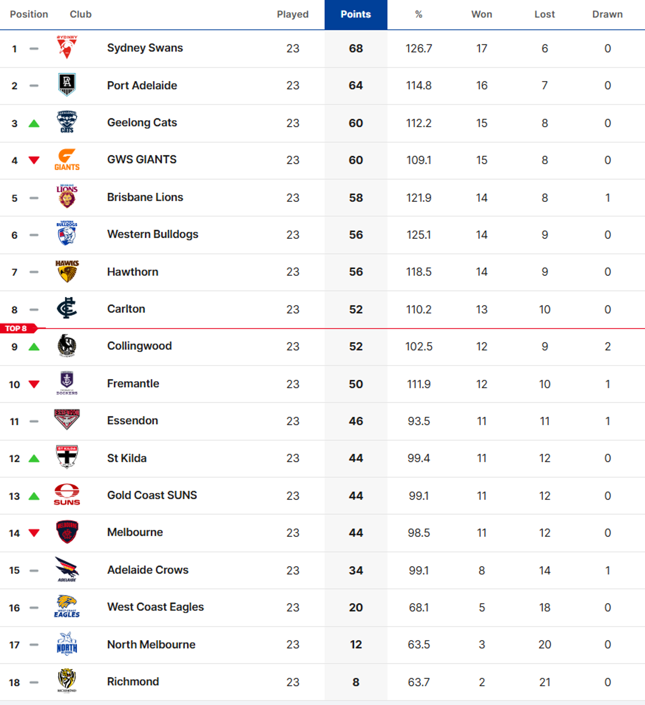

## Introduction

A bit of background for non AFL fans:

In the Australian Football League (AFL), 18 teams compete in the **regular** season across 24 rounds.
    -   Teams that win a match receive 4 points
    -   Teams that draw receive 2 points
    -   Teams that lose receive 0 points

For example, here is the ladder at the end of the 2024 regular season:



Then, the top 8 teams (based on points) qualify for the **finals** series:


With just the information we have on hand, can we predict the outcomes of the finals series? I.e. which team will win the premiership? If we use just the ladder, then our best bet would be to back Sydney as the winners, but is that the best we can do?

In this workshop, we explore whether we can improve predictions of finals outcomes by using:

-   Elo ratings (based on match results)
-   A random forest model (based on in-match statistics)

We will:

1.  Build models using **regular season data only**
2.  Generate matchup probabilities for the top 8 teams
3.  Simulate the AFL finals series
4.  Compare results to the ladder


## Setup

```{r}
library(tidyverse)
library(fitzRoy)
library(tidymodels)
library(ranger)
library(gtools)
library(elo)
```


## Data Collection

We will use the `fitzRoy` R package, which provides a convenient interface for retrieving AFL data from multiple sources, including "AFL Tables".

The package allows us to easily obtain:

- Match results (scores, margins, teams)
- Player-level statistics (kicks, marks, inside 50s, etc.)
- Historical data across multiple seasons

In this workshop, we focus on 2024 season data.

```{r}
afl2024 <- fitzRoy::fetch_results_afltables(season = 2024)
```

### Use Regular season for the training data

To ensure a fair evaluation, we restrict our analysis to the regular season only when building models.

```{r}
afl2024_rr <- afl2024 |> filter(Round.Type == "Regular") 
```

## The ELO Model

The first model we will try to build is the Elo model, which is a simple rating system that updates team ratings based on match outcomes. The key ideas are:

- Two players (or teams) start with an initial rating ($R_0$)
- After a match, the winner takes points from the loser, and the amount depends on the expected outcome. For example:
  - If a strong team beats a weak team, the rating change is small, but 
  - If a weak team beats a strong team, the rating change is large.


::: {.callout-note .panel-tabset}

## Example 1 (Expected win)

- Player A (initial rating = 1600) plays a match against player B (initial rating = 1400).
- Player A beats player B in this match
- Player A gains 8 points (new elo rating becomes 1608), whereas Player B loses 8 points (new elo rating becomes 1392)

:::

::: {.callout-note .panel-tabset}

## Example 2 (Unexpected win)

- Player A (initial rating = 1600) plays a match against player B (initial rating = 1400).
- Player B beats player A in this match
- Player B gains 24 points (new elo rating becomes 1424), whereas Player A loses 24 points (new elo rating becomes 1576)

:::

The formula for updating ratings is:

$$R_{updated} = R_{0} + K \times (S - P)$$

Where:

  - R is the rating, 
  - K is a constant that determines how much ratings change after each match, 
  - S is the actual score (1 for a win, 0.5 for a draw, 0 for a loss), and 
  - P is the expected probability based on the ratings of the two players.

The probability, P, of player A beating player B can be calculated using the formula: 

$$
P(A) = \frac{1}{1 + 10^{(R_B - R_A)/400}}
$$

We can use the `elo.prob()` function from the `elo` package to calculate these probabilities based on the ratings of the two teams.

```{r}
elo::elo.prob(1600, 1400)
```


Elo models are often highly effective in sports despite their simplicity because they capture the key driver of outcomes: **relative team strength**. By continuously updating ratings based on match results and opponent quality, Elo naturally adjusts for strength of schedule and recent performance without requiring detailed data. This allows it to produce well-calibrated probabilities and robust rankings using only win–loss information.

To use the ELO model with our current data, we just need one more variable, Score (S):

```{r}
afl2024_rr_elo <- afl2024_rr |> 
  mutate(
    Score = case_when(
      Margin > 0  ~ 1,
      Margin == 0 ~ 0.5,
      Margin < 0  ~ 0
    )
  ) |> 
  select(Round, Home.Team, Away.Team, Score)
```

### Implementing ELO

To estimate Elo ratings, we use the `elo.run()` function from the `elo` package. This function provides a convenient way to apply the Elo updating procedure across a sequence of matches. In our case, we specify the model as:

```{r}
elo_fit <- elo::elo.run(
  Score ~ Home.Team + Away.Team,
  data = afl2024_rr_elo,
  initial.elos = 1500,
  k = 50,
  history = TRUE
)
```

Note: I am using arbitrary values for the initial ratings and K factor, but these can be tuned for better performance.

At the end of round 24, the elo ratings are:

```{r}
final_ratings <- final.elos(elo_fit) |> 
  enframe(name = "team", value = "elo")  |> 
  arrange(desc(elo))
```

To build our prediction model for the final series, we'll take the top 8 teams from the ladder:

```{r}
top_8 <- final_ratings |> 
  filter(team %in% c("Sydney", "Brisbane Lions", "Footscray", "Port Adelaide", 
                 "GWS", "Carlton", "Hawthorn", "Geelong"))
```

With the current ELO ratings, we can use the `elo.prob()` function to estimate the probability of each team beating every other team in the top 8. For example, match 1 was Sydney versus GWS:

```{r}
elo::elo.prob(1602.940, 1602.270)
```


::: {.callout-note}

## Simulatation in Sports

In sports, it is common to use simulation to estimate outcomes in complex tournament settings where results depend on multiple sequential events. To estimate each team’s chance of winning the premiership, we simulate the AFL finals series using the match probabilities derived from our models. Because each round depends on previous results, calculating exact probabilities is difficult. Instead, we repeatedly simulate each match by sampling a winner based on the estimated probabilities, progressing teams through the finals bracket. By running many simulations, we approximate the distribution of outcomes and estimate how often each team wins the premiership.

:::

To simulate the final series, we will create a grid of all possible matchups between the top 8 teams, calculate the probabilities of each team winning against every other team, and then simulate the matches based on those probabilities.

```{r}
grid <- gtools::permutations(
  n = 8,
  r = 2,
  v = top_8$team,,
  repeats.allowed = FALSE
) |> 
  as_tibble() |>
  rename(team = V1, opp = V2)
```

Then we will join the ELO ratings from the current model:

```{r}
grid_elo <- grid |> 
    # Attach team ELO
  left_join(final_ratings, by = c("team" = "team")) |> 
  rename(team_elo = elo) |>
  
  # Attach opp ELO
  left_join(final_ratings, by = c("opp" = "team")) |> 
  rename(opp_elo = elo)
```

Finally, we can use the `elo.prob()` function to calculate the probability of each team winning against every other team:

```{r}
grid_prob <- grid_elo |> 
  mutate(
    # teamProb
    teamProb = elo::elo.prob(team_elo, opp_elo),
    
    # oppProb
    oppProb = 1 - teamProb)
```

::: {.callout-note}

## `sample()`

We can use the `sample()` function to choose a winner based on the probabilities we have calculated. For example, suppose Brisbane (ELO = 1586.272) was to play Carlton (ELO = 1503.476). The probabilities here are 0.617 and 0.383. This means, the `sample()` function should pick Brisbane as the winner more times than Carlton.

```{r}
sample(c("Brisbane", "Carlton"), 1, prob = c(0.617, 0.383))
```

:::

### Write a function to simulate the finals

TLDR; 

```{r}
simulate_afl_finals <- function(grid_prob, n_sims = 1000) {
  
  results <- list()
  
  for (i in 1:n_sims) {
    
    # --- Week 1 ---
    week1 <- data.frame(
      finalID = c("QF1", "QF2", "EF1", "EF2"),
      team    = c("Sydney", "Port Adelaide", "Brisbane Lions", "Footscray"),
      opp     = c("GWS", "Geelong", "Carlton", "Hawthorn")
    ) |>
      left_join(grid_prob, by = c("team", "opp"))
    
    QF1 <- week1[1, ]; QF2 <- week1[2, ]; EF1 <- week1[3, ]; EF2 <- week1[4, ]
    
    QF1_res <- sample(c("team", "opp"), 1, prob = c(QF1$teamProb, QF1$oppProb))
    QF2_res <- sample(c("team", "opp"), 1, prob = c(QF2$teamProb, QF2$oppProb))
    EF1_res <- sample(c("team", "opp"), 1, prob = c(EF1$teamProb, EF1$oppProb))
    EF2_res <- sample(c("team", "opp"), 1, prob = c(EF2$teamProb, EF2$oppProb))
    
    QF1 <- QF1 |>
      mutate(
        winner = ifelse(QF1_res == "team", team, opp),
        loser  = ifelse(QF1_res == "team", opp, team)
      )
    QF2 <- QF2 |>
      mutate(
        winner = ifelse(QF2_res == "team", team, opp),
        loser  = ifelse(QF2_res == "team", opp, team)
      )
    EF1 <- EF1 |>
      mutate(
        winner = ifelse(EF1_res == "team", team, opp),
        loser  = ifelse(EF1_res == "team", opp, team)
      )
    EF2 <- EF2 |>
      mutate(
        winner = ifelse(EF2_res == "team", team, opp),
        loser  = ifelse(EF2_res == "team", opp, team)
      )
    
    week1_output <- bind_rows(QF1, QF2, EF1, EF2)
    
    Q1W <- week1_output$winner[1]; Q1L <- week1_output$loser[1]
    Q2W <- week1_output$winner[2]; Q2L <- week1_output$loser[2]
    E1W <- week1_output$winner[3]; E1L <- week1_output$loser[3]
    E2W <- week1_output$winner[4]; E2L <- week1_output$loser[4]
    
    # --- Week 2 ---
    week2 <- data.frame(
      finalID = c("SF1", "SF2"),
      team    = c(Q1L, Q2L),
      opp     = c(E1W, E2W)
    ) |>
      left_join(grid_prob, by = c("team", "opp"))
    
    SF1 <- week2[1, ]; SF2 <- week2[2, ]
    
    SF1_res <- sample(c("team", "opp"), 1, prob = c(SF1$teamProb, SF1$oppProb))
    SF2_res <- sample(c("team", "opp"), 1, prob = c(SF2$teamProb, SF2$oppProb))
    
    SF1 <- SF1 |>
      mutate(
        winner = ifelse(SF1_res == "team", team, opp),
        loser  = ifelse(SF1_res == "team", opp, team)
      )
    SF2 <- SF2 |>
      mutate(
        winner = ifelse(SF2_res == "team", team, opp),
        loser  = ifelse(SF2_res == "team", opp, team)
      )
    
    week2_output <- bind_rows(SF1, SF2)
    
    SF1W <- week2_output$winner[1]; SF1L <- week2_output$loser[1]
    SF2W <- week2_output$winner[2]; SF2L <- week2_output$loser[2]
    
    # --- Week 3 ---
    week3 <- data.frame(
      finalID = c("PF1", "PF2"),
      team    = c(Q1W, Q2W),
      opp     = c(SF2W, SF1W)
    ) |>
      left_join(grid_prob, by = c("team", "opp"))
    
    PF1 <- week3[1, ]; PF2 <- week3[2, ]
    
    PF1_res <- sample(c("team", "opp"), 1, prob = c(PF1$teamProb, PF1$oppProb))
    PF2_res <- sample(c("team", "opp"), 1, prob = c(PF2$teamProb, PF2$oppProb))
    
    PF1 <- PF1 |>
      mutate(
        winner = ifelse(PF1_res == "team", team, opp),
        loser  = ifelse(PF1_res == "team", opp, team)
      )
    PF2 <- PF2 |>
      mutate(
        winner = ifelse(PF2_res == "team", team, opp),
        loser  = ifelse(PF2_res == "team", opp, team)
      )
    
    week3_output <- bind_rows(PF1, PF2)
    
    PF1W <- week3_output$winner[1]; PF1L <- week3_output$loser[1]
    PF2W <- week3_output$winner[2]; PF2L <- week3_output$loser[2]
    
    # --- Week 4 (Grand Final) ---
    week4 <- data.frame(
      finalID = "GF",
      team    = PF1W,
      opp     = PF2W
    ) |>
      left_join(grid_prob, by = c("team", "opp"))
    
    GF <- week4[1, ]
    GF_res <- sample(c("team", "opp"), 1, prob = c(GF$teamProb, GF$oppProb))
    
    GF <- GF |>
      mutate(
        winner = ifelse(GF_res == "team", team, opp),
        loser  = ifelse(GF_res == "team", opp, team)
      )
    
    standings <- data.frame(
      simulation_id = i,
      Result = c(
        "Eliminated EF", "Eliminated EF",
        "Eliminated SF", "Eliminated SF",
        "Eliminated PF", "Eliminated PF",
        "RunnerUp", "Winner"
      ),
      Team = c(E1L, E2L, SF1L, SF2L, PF1L, PF2L, GF$loser, GF$winner)
    )
    
    results[[i]] <- standings
  }
  
  bind_rows(results)
}
```

### Run the simulation

```{r}
set.seed(12345)
finals_simulation_results <- 
  simulate_afl_finals(grid_prob = grid_elo, n_sims = 1000)
```

### Summarise results

```{r}
finals_simulation_results %>%
  group_by(Team, Result) %>%
  summarise(n = n()) %>%
  tidyr::pivot_wider(names_from = Result, values_from = n, values_fill = 0) %>%
  mutate(TotalSims = rowSums(across(where(is.numeric))),
         WinPct = Winner / TotalSims * 100,
         RunnerUpPct = RunnerUp / TotalSims * 100) |>
  select(1:6) |> 
  arrange(Winner)
```

## Moving Beyond Elo: A Machine Learning Approach

The Elo model provides a strong and intuitive baseline for modelling team strength. It is simple, interpretable, and incorporates key information such as match outcomes and opponent strength. Despite using only win–loss results, Elo often performs surprisingly well in sports prediction tasks.

However, Elo has an important limitation:

> It relies solely on match outcomes and does not incorporate how those outcomes were achieved.

In AFL, rich in-match statistics are available that describe team performance in much greater detail. For example:

- Inside 50s (territory and scoring opportunities)
- Contested possessions (pressure and physical dominance)
- Kicks and marks (ball movement and control)

These variables capture aspects of team performance that are not reflected in the final score alone.

In the next section, we build a random forest model using regular-season in-match statistics to estimate match outcome probabilities. These probabilities will then be used, alongside the ELO model, to simulate the AFL finals series and compare results.

Note: to keep things simple, we'll just use aggregated team-level statistics. Specifically, we summarise player statistics within each match to create team-level measures such as total kicks, marks, inside 50s, and contested possessions.

### Data Collection 2

```{r}
# Note the change in function (player stats instead of match results)
afl2024 <- fitzRoy::fetch_player_stats_afltables(season = 2024)
```


```{r}
# Annoyingly, the variable names are different as well
afl2024_rr <- afl2024 |> filter(Round %in% c(1:23))
```

```{r}
# These are probably the main ones to focus on (don't choose obvious things, like goals)
afl2024_rr |> 
  select(Kicks:Bounces) |> 
  str()
```

```{r}
# These are the ones I selected:
afl2024r <- afl2024_rr %>% 
  filter(Round %in% c(1:23)) %>% 
  select(
    # Required stats
    Round, 
    Date, 
    Home.team, 
    Away.team, 
    Home.score, 
    Away.score, 
    Playing.for, 
    # These are the in-match stats I chose to use
    Kicks,
    Marks,
    Inside.50s,
    Tackles,
    Frees.For)
```

```{r}
# Aggregate at the team level (Home)
df_2024_Home <- afl2024r %>% 
  group_by(Round, Playing.for) %>% 
  mutate(Home.Kicks = ifelse(Home.team == Playing.for, sum(Kicks), NA),
         Home.Marks = ifelse(Home.team == Playing.for, sum(Marks), NA),
         Home.Inside.50s = ifelse(Home.team == Playing.for, sum(Inside.50s), NA),
         Home.Tackles = ifelse(Home.team == Playing.for, sum(Tackles), NA),
         Home.Frees.For = ifelse(Home.team == Playing.for, sum(Frees.For), NA)) %>% 
  filter(row_number() == 1) %>% 
  filter(!is.na(Home.Kicks)) %>% 
  ungroup() %>% 
  select(Round, Home.team, Home.score, Home.Kicks, Home.Marks,Home.Inside.50s, Home.Tackles, Home.Frees.For)

# Aggregate at the team level (Away)
df_2024_Away <- afl2024r %>% 
  group_by(Round, Playing.for) %>% 
  mutate(Away.Kicks = ifelse(Away.team == Playing.for, sum(Kicks), NA),
         Away.Marks = ifelse(Away.team == Playing.for, sum(Marks), NA),
         Away.Inside.50s = ifelse(Away.team == Playing.for, sum(Inside.50s), NA),
         Away.Tackles = ifelse(Away.team == Playing.for, sum(Tackles), NA),
         Away.Frees.For = ifelse(Away.team == Playing.for, sum(Frees.For), NA)) %>% 
  filter(row_number() == 1) %>% 
  filter(!is.na(Away.Kicks)) %>% 
  ungroup() %>% 
  select(Round, Away.team, Away.score, Away.Kicks, Away.Marks,Away.Inside.50s, Away.Tackles, Away.Frees.For)

# Good old cbind
df_2024_final <- 
  df_2024_Home %>% 
  cbind(df_2024_Away) %>% 
  select(c(1,2,10,3,11,4:8,12:16)) %>% 
  mutate(Score = factor(ifelse(Home.score > Away.score, 1, 0)),
         Margin = Home.score - Away.score)
```

### Build the model

I'm using the `tidy

```{r}
# create a random forest spec
rf_spec <- rand_forest() %>% 
  set_engine("ranger") %>% 
  set_mode("classification")

rf_fit <- 
  rf_spec %>% 
  fit(Score ~ Home.Kicks + Away.Kicks +
        Home.Marks + Away.Marks +
        Home.Inside.50s + Away.Inside.50s +
        Home.Frees.For + Away.Frees.For, data = df_2024_final)
```

### Create the grid again

Annoyingly, the different fetch functions use different team names.

Here I am aggregating the in-match statistics at the team level across the regular season, and then creating a grid of all possible matchups between the top 8 teams.

```{r}
Home <- 
  df_2024_final %>% 
  group_by(Home.team) %>% 
  summarise(Home.Kicks = mean(Home.Kicks),
            Home.Marks = mean(Home.Marks),
            Home.Inside.50s = mean(Home.Inside.50s),
            Home.Tackles = mean(Home.Tackles),
            Home.Frees.For = mean(Home.Frees.For)) %>% 
  rename(team = Home.team)%>% 
  filter(team %in% c("Sydney",
                     "GWS",
                     "Brisbane Lions",
                     "Carlton",
                     "Footscray",
                     "Hawthorn",
                     "Port Adelaide",
                     "Geelong")) %>% 
  mutate(team = case_when(
    team == 'Sydney' ~ 'Sydney',
    team == 'GWS' ~ 'GWS',
    team == 'Brisbane Lions' ~ 'Brisbane Lions',
    team == 'Carlton' ~ 'Carlton',
    team == 'Footscray' ~ 'Footscay',
    team == 'Hawthorn' ~ 'Hawthorn',
    team == 'Port Adelaide' ~ 'Port Adelaide',
    team == 'Geelong' ~ 'Geelong'
  ))

Away <- 
  df_2024_final %>% 
  group_by(Away.team) %>% 
  summarise(Away.Kicks = mean(Away.Kicks),
            Away.Marks = mean(Away.Marks),
            Away.Inside.50s = mean(Away.Inside.50s),
            Away.Tackles = mean(Away.Tackles),
            Away.Frees.For = mean(Away.Frees.For)) %>% 
  rename(team = Away.team)%>% 
  filter(team %in% c("Sydney",
                     "GWS",
                     "Brisbane Lions",
                     "Carlton",
                     "Footscray",
                     "Hawthorn",
                     "Port Adelaide",
                     "Geelong")) %>% 
  mutate(team = case_when(
    team == 'Sydney' ~ 'Sydney',
    team == 'GWS' ~ 'GWS',
    team == 'Brisbane Lions' ~ 'Brisbane Lions',
    team == 'Carlton' ~ 'Carlton',
    team == 'Footscray' ~ 'Footscay',
    team == 'Hawthorn' ~ 'Hawthorn',
    team == 'Port Adelaide' ~ 'Port Adelaide',
    team == 'Geelong' ~ 'Geelong'
  )) %>% 
  rename(opp = team)

# Make grid
grid <- 
  gtools::permutations(n = 8, r = 2, c('Sydney',
                               'GWS',
                               'Brisbane Lions',
                               'Carlton',
                               'Footscray',
                               'Hawthorn',
                               'Port Adelaide',
                               'Geelong'), 
               repeats.allowed = FALSE) %>% 
  as.data.frame()

grid <- 
  grid %>% 
  rename(team = V1,
         opp = V2) %>% 
  left_join(Home) %>% 
  left_join(Away) %>% 
  mutate_if(is.numeric, round, 0)
```

### use the rf model to make predictions

```{r}
grid <- 
  augment(rf_fit, new_data = grid) %>% 
  select(team, opp, .pred_1, .pred_0) %>% 
  rename(teamProb = 3,
         oppProb = 4)
```

### Simulate the finals

```{r}
set.seed(12345)
finals_simulation_results <- 
  simulate_afl_finals(grid_prob = grid, n_sims = 1000)
```

### Summarise results

```{r}
# Summarise:
finals_simulation_results %>%
  group_by(Team, Result) %>%
  summarise(n = n()) %>%
  tidyr::pivot_wider(names_from = Result, values_from = n, values_fill = 0) %>%
  mutate(TotalSims = rowSums(across(where(is.numeric))),
         WinPct = Winner / TotalSims * 100,
         RunnerUpPct = RunnerUp / TotalSims * 100) |>
  select(1,2,3,4,5,6) |> 
  arrange(Winner)
```


